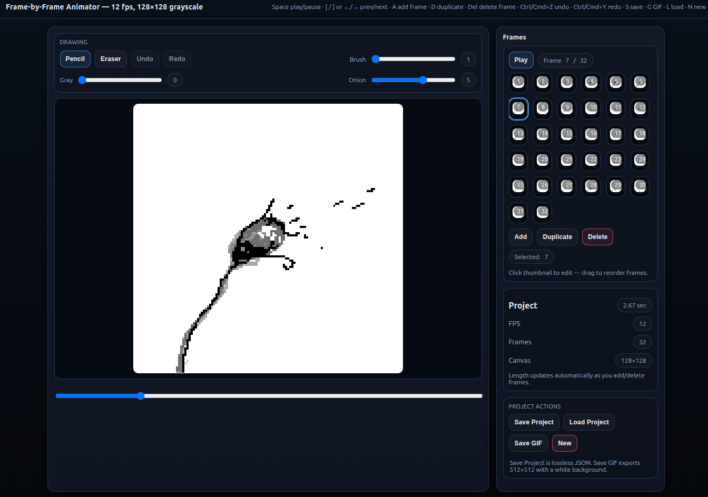

# Animator

A minimal browser-based frame-by-frame animator and GIF exporter.

## What it is for 

- Create simple animations in the browser and export them as a project JSON or a GIF.
- Small, dependency-light implementation using `animator.html` and `vendor/gif.js`.

GUI Screenshot



> **Tip:** Open `animator.html` in a browser to view the UI shown above.

Example GIF


## Project layout 

- `animator.html` — main UI and app logic (canvas, frame editing, import/export).
- `vendor/gif.js`, `vendor/gif.worker.js` — GIF encoding (used for `Export GIF`). This project includes a bundled copy of gif.js [https://github.com/jnordberg/gif.js](https://github.com/jnordberg/gif.js) for offline builds — gif.js is MIT-licensed; include or reference its LICENSE when redistributing.
- The `example/` folder contains saved project JSONs you can load from the UI using **Project Actions → Load Project**. To validate those files locally, run `node scripts/validate_examples.js` (checks `frameCount` and per-frame byte lengths).
- `example/` — saved project JSONs (examples and tests).

## Data format (project JSON) 

Schema (concise):

```json
{
  "version": "1.x",
  "width": 128,
  "height": 128,
  "fps": 12,
  "frameCount": 32,
  "timestamp": "2025-12-24T17:33:23.149Z",
  "frames": [ "<base64-image>", "<base64-image>", ... ]
}
```

- `version`: project format version string.
- `width`, `height`: canvas size in pixels.
- `fps`: frames per second for playback/export.
- `frameCount`: expected number of frames (should match `frames.length`).
- `timestamp`: ISO timestamp when exported.
- `frames`: ordered array of base64-encoded image payloads (one per frame).

> Note: frames are stored as base64 image data (payload strings). The app expects the array order to be the playback order.

## Montage (Film) Editor — Draft spec 

**Goal:** arrange animation "chunks" (segments from existing project JSONs) in a timeline, supporting batch import, insert-before, drag-to-reorder, non-destructive **trimming** (time-axis, by frames), and save/load of a montage project. The UI will remain **vanilla** and simple; imports must match the montage `width`/`height`/`fps` (validated, see `scripts/validate_examples.js`).

**Montage project JSON (draft):**

```json
{
  "version": "montage-1.0",
  "width": 128,
  "height": 128,
  "fps": 12,
  "timestamp": "2025-12-25T09:00:00Z",
  "chunks": [
    {
      "id": "chunk-uuid-1",
      "name": "intro",
      "source": {
        "type": "reference",
        "ref": "example/animation-project-2025-12-24T17-33-23-167Z.json"
      },
      "frameRange": { "start": 0, "end": 15 },
      "derived": true,
      "meta": {}
    },
    {
      "id": "chunk-uuid-2",
      "name": "embedded",
      "source": {
        "type": "embedded",
        "project": { /* full original project JSON */ }
      },
      "frameRange": { "start": 0, "end": 31 },
      "derived": false
    }
  ]
}
```

**Notes:**

- Each chunk references (by default) an existing project JSON and a 0-based frame range `[start, end)` (start inclusive, end exclusive). The montage **must not** modify the original project — trimming is non-destructive and stored only as metadata in the montage file (the original project JSON is left unchanged).
- **Embedding:** later we can allow `source.type = "embedded"` to store a full copy of the original project inside the montage file (useful for portability); for now, prefer references.
- **Validation:** imported chunks must match the montage `width`, `height`, and `fps`; use `scripts/validate_examples.js` as a starting point for enforcement. Auto-scaling is out-of-scope for this phase.
- **Trimming (time-based):** use `frameRange` to select the subset of frames from the source for playback in the montage. Trimming a chunk creates a derived chunk (new `id`) visible in the montage timeline. Offer a UI action **"Save trimmed chunk"** to export the derived chunk as a standalone project JSON if the user wants it saved separately.
- **Ordering:** the `chunks` array is ordered; the UI will show per-chunk duration and total timeline length, and allow drag-drop to reorder and insert-before a selected chunk.
- **Interactions:** planned interactions with the existing chunk editor (e.g., insert current chunk into the montage, edit selected chunk in frame editor) are noted but deferred.
- **Saving:** use a new `montage-1.0` version field for the montage project format. We'll add example montage files to `example/` and extend the validator as we implement imports.

**Wireframes & interaction details:** See `docs/montage-wireframes.md` for ASCII wireframes, interaction notes, and a short implementation-ready API list.

## How to use 

- Open `animator.html` in a browser (no build step required).
- Use UI buttons to add frames, play, import/export JSON, and export GIF.

## Implementation details — `animator.html` 

- **Data model**: `frames` is an Array of `Uint8Array` (length `W*H`), one byte per pixel (0 = black, 255 = white). New frames are created with `makeBlankFrame()`.
- **Save / Load**: `saveProject()` serializes raw bytes as base64 (`btoa(String.fromCharCode(...))`); `loadProject()` decodes with `atob()` and validates `width`, `height`, and frame lengths.
- **Rendering**: an offscreen canvas `off` (W×H) is composed via `composeWithOnionSkin()` (or `composeFrameOnly()`), then scaled and drawn to the visible `main` canvas by `renderMain()` (uses `DISPLAY` and device DPR).
- **Drawing & tools**: `drawDot()` (square brush) and `drawLine()` (Bresenham) implement strokes. Pointer events on `main` drive `applyStroke()`; the current drawing mode is controlled by `setTool()` and the `tool` variable.
- **Undo / Redo**: per-frame `undoStacks`/`redoStacks` hold stroke deltas recorded from `activeStrokeMap` and committed in `commitStroke()` as `{idxs, before, after}`; `undo()`/`redo()` apply deltas with `applyDelta()`.
- **Timeline & thumbnails**: `insertFrame()`, `duplicateAfterCurrent()`, `deleteCurrentFrame()` modify `frames`; `initThumbs()` and `renderThumb()` maintain the thumbnail grid.
- **Playback**: `setPlaying()` uses `setInterval` with `FPS` to step frames and disables editing while playing.
- **GIF Export**: `saveGif()` composes frames at `DISPLAY` (512) onto a white background and uses `gif.js`; `getGifWorkerBlobUrl()` loads `./vendor/gif.worker.js` or falls back to CDN.

**Configuration & maintenance tips** 

- Change `W`, `H` for the internal raster size, `DISPLAY` for on-screen/export resolution, and `FPS` for playback frame rate.
- Notifications now use non-blocking in-page toasts (instead of blocking `alert()`), shown in the bottom-right.
- To support color, switch frames to RGBA arrays and update compose / draw functions accordingly.
- To change brush shape (round vs square), adjust `drawDot()` behavior.
- To add tools, add a UI control, set the new tool name in `setTool()`, and handle it in `applyStroke()`.
- For autosave or cloud sync, hook into project changes and reuse `saveProject()`/`loadProject()` logic.
- Keep `frameCount` in sync with `frames.length`; `loadProject()` checks lengths and will error on mismatch.

> Note: frames are raw byte payloads base64-encoded in the project file; if you prefer portable images (PNG) swap to data-URI encoding in `saveProject()`/`loadProject()`.
