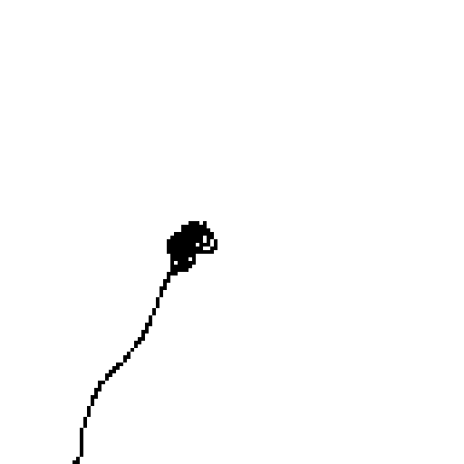

# Animator

A minimal browser-based frame-by-frame animator and GIF exporter.

## What it is for ✅
- Create simple animations in the browser and export them as a project JSON or a GIF.
- Small, dependency-light implementation using `animator.html` and `vendor/gif.js`.

**GUI Screenshot**


> **Tip:** Open `animator.html` in a browser to view the UI shown above.

**Example GIF**



## Project layout 🔧
- `animator.html` — main UI and app logic (canvas, frame editing, import/export).
- `vendor/gif.js`, `vendor/gif.woker.js` — GIF encoding (used for `Export GIF`).
- `example/` — saved project JSONs (examples and tests).

## Data format (project JSON) 💾
Schema (concise):

```json
{
  "version": "1.x",
  "width": 128,
  "height": 128,
  "fps": 12,
  "frameCount": 32,
  "timestamp": "2025-12-24T17:33:23.149Z",
  "frames": [ "<base64-image>", "<base64-image>", ... ]
}
```
- `version`: project format version string.
- `width`, `height`: canvas size in pixels.
- `fps`: frames per second for playback/export.
- `frameCount`: expected number of frames (should match `frames.length`).
- `timestamp`: ISO timestamp when exported.
- `frames`: ordered array of base64-encoded image payloads (one per frame).

> Note: frames are stored as base64 image data (payload strings). The app expects the array order to be the playback order.

## How to use ✨
- Open `animator.html` in a browser (no build step required).
- Use UI buttons to add frames, play, import/export JSON, and export GIF.


## Implementation details — `animator.html` 🔍

- **Data model**: `frames` is an Array of `Uint8Array` (length `W*H`), one byte per pixel (0 = black, 255 = white). New frames are created with `makeBlankFrame()`.
- **Save / Load**: `saveProject()` serializes raw bytes as base64 (`btoa(String.fromCharCode(...))`); `loadProject()` decodes with `atob()` and validates `width`, `height`, and frame lengths.
- **Rendering**: an offscreen canvas `off` (W×H) is composed via `composeWithOnionSkin()` (or `composeFrameOnly()`), then scaled and drawn to the visible `main` canvas by `renderMain()` (uses `DISPLAY` and device DPR).
- **Drawing & tools**: `drawDot()` (square brush) and `drawLine()` (Bresenham) implement strokes. Pointer events on `main` drive `applyStroke()`; the current drawing mode is controlled by `setTool()` and the `tool` variable.
- **Undo / Redo**: per-frame `undoStacks`/`redoStacks` hold stroke deltas recorded from `activeStrokeMap` and committed in `commitStroke()` as `{idxs, before, after}`; `undo()`/`redo()` apply deltas with `applyDelta()`.
- **Timeline & thumbnails**: `insertFrame()`, `duplicateAfterCurrent()`, `deleteCurrentFrame()` modify `frames`; `initThumbs()` and `renderThumb()` maintain the thumbnail grid.
- **Playback**: `setPlaying()` uses `setInterval` with `FPS` to step frames and disables editing while playing.
- **GIF Export**: `saveGif()` composes frames at `DISPLAY` (512) onto a white background and uses `gif.js`; `getGifWorkerBlobUrl()` loads `./vendor/gif.worker.js` or falls back to CDN.

**Configuration & maintenance tips** ✨

- Change `W`, `H` for the internal raster size, `DISPLAY` for on-screen/export resolution, and `FPS` for playback frame rate.
- To support color, switch frames to RGBA arrays and update compose / draw functions accordingly.
- To change brush shape (round vs square), adjust `drawDot()` behavior.
- To add tools, add a UI control, set the new tool name in `setTool()`, and handle it in `applyStroke()`.
- For autosave or cloud sync, hook into project changes and reuse `saveProject()`/`loadProject()` logic.
- Keep `frameCount` in sync with `frames.length`; `loadProject()` checks lengths and will error on mismatch.

> Note: frames are raw byte payloads base64-encoded in the project file; if you prefer portable images (PNG) swap to data-URI encoding in `saveProject()`/`loadProject()`.