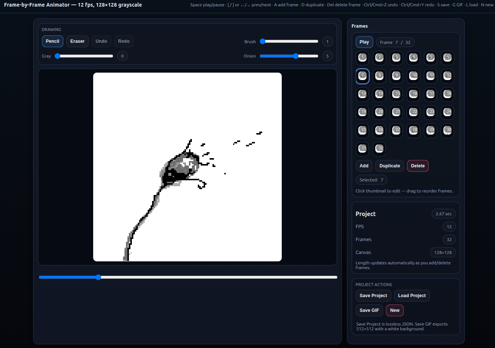

# Frame-by-frame Pixel Animator

A minimal browser-based frame-by-frame animator and GIF exporter, optimized for e-ink tablets.

## What it is for

- Create simple animations in the browser and export them as a project JSON or a GIF/WebM video.
- Small, dependency-light implementation using `animator.html` and bundled `vendor/gif.js` (loaded locally, no CDN required).
- **NEW**: Optimized for e-ink tablets (reMarkable, Boox, Kindle) with light theme and touch gestures.

## Features

- **Chunk Editor**: Draw frame-by-frame animations with pencil, soft brush, and eraser tools
- **Montage Editor**: Assemble animations from multiple chunks with timeline editing
- **RGBA Color Support**: Full color with transparency/alpha channel
- **Touch Support**: Pinch-to-zoom, touch-friendly buttons (44px), and smooth scrolling without pull-to-refresh interference
- **Tool Deselection**: Click active tool again to deselect and prevent drawing
- **Zoom Lock**: Lock/unlock zoom (🔒/🔓) to prevent all accidental pinch gestures while drawing, including during fast strokes
- **E-ink Optimized**: High-contrast light theme perfect for e-ink displays (reMarkable, Boox, Kindle)
- **Responsive Layout**: Works on desktop, tablet, and mobile devices with optimized canvas scaling for maximum workspace
- **Offline Capable**: No server required, works completely offline

GUI Screenshot



> **Tip:** Open `animator.html` in a browser to view the UI shown above.

Example GIF


## Project layout

- `animator.html` — main UI and app logic (canvas, frame editing, import/export)
- `vendor/gif.js`, `vendor/gif.worker.js` — GIF encoding library (used for GIF export). This project includes a bundled copy of [gif.js](https://github.com/jnordberg/gif.js) (MIT-licensed) for offline use
- `example/` — sample project JSONs and exported animations for testing

## Data format (project JSON)

Schema (concise):

```json
{
  "version": "2.0",
  "width": 128,
  "height": 128,
  "fps": 12,
  "frameCount": 32,
  "timestamp": "2025-12-27T08:00:00.000Z",
  "frames": [ "<base64-rgba-data>", "<base64-rgba-data>", ... ]
}
```

- `version`: project format version string. Version `2.0` uses RGBA format (4 bytes per pixel). Version `1.x` used grayscale (1 byte per pixel) and is automatically converted to RGBA on load.
- `width`, `height`: canvas size in pixels.
- `fps`: frames per second for playback/export.
- `frameCount`: expected number of frames (should match `frames.length`).
- `timestamp`: ISO timestamp when exported.
- `frames`: ordered array of base64-encoded RGBA image data (one per frame, W×H×4 bytes each).

> Note: frames are stored as base64-encoded raw pixel data (RGBA format). Validation enforces byte lengths (v2.0: W×H×4, legacy v1.x: W×H×1). The app expects the array order to be the playback order. Legacy v1.x grayscale projects are automatically converted to RGBA when loaded.

## Montage (Film) Editor

The Montage Editor allows you to arrange multiple animation "chunks" (segments from project JSON files) into a timeline, with support for:

- **Batch import**: Load multiple project JSONs at once
- **Chunk reordering**: Drag-and-drop to rearrange chunks in the timeline
- **Non-destructive trimming**: Adjust start/end frames without modifying source data
- **Color coding**: Assign colors to chunks for visual organization
- **Timeline preview**: Hover over the scrubber to preview frames
- **Playback**: Preview the complete montage sequence
- **Export**: Save as montage JSON or export as GIF/WebM video

**Montage project JSON format:**

```json
{
  "version": "montage-1.0",
  "width": 128,
  "height": 128,
  "fps": 12,
  "timestamp": "2025-12-25T09:00:00Z",
  "chunks": [
    {
      "id": "chunk-uuid-1",
      "name": "intro",
      "alias": "intro-cut",
      "source": {
        "type": "embedded",
        "project": { /* full original project JSON */ }
      },
      "frameRange": { "start": 0, "end": 15 },
      "derived": false
    },
    {
      "id": "chunk-uuid-2",
      "name": "scene2",
      "alias": "main-scene",
      "source": {
        "type": "embedded",
        "project": { /* full original project JSON */ }
      },
      "frameRange": { "start": 5, "end": 31 },
      "derived": true
    }
  ]
}
```

**Key features:**

- **Embedded chunks**: Each chunk contains a complete copy of the original project JSON for portability
- **Alias/Cut names**: Customizable display names for each chunk
- **Non-destructive trimming**: `frameRange` specifies visible frames without modifying source data
- **Validation**: Imported chunks must match montage dimensions (width, height, fps)
- **Drag-and-drop reordering**: Intuitive timeline organization
- **Chunk-to-chunk editing**: Edit chunks in the frame editor and return to montage

## How to use

- Open `animator.html` in a browser (no build step required).
- Use UI buttons to add frames, play, import/export JSON, and export GIF.

### Chunk Editor Mode

- **Drawing tools**: Pencil, Eraser, Soft brush, and Selection tool
  - **Tool deselection**: Click active tool button again to deselect - prevents drawing when no tool is selected
- **Zoom lock button**: Lock/unlock zoom (🔒/🔓 icons) to prevent accidental pinch gestures while drawing
- **Color palette**: Quick-access grayscale buttons (0, 64, 128, 192, 255) for fast color selection
- **Mouse controls**: 
  - Scroll wheel to adjust brush size
  - C + wheel or Ctrl/Cmd + wheel to zoom canvas (50%-300%)
  - Canvas zoom reset button (Zoom 100%)
- **Touch controls**:
  - Pinch-to-zoom with two fingers (50%-300%)
  - Double-tap to reset zoom to 100%
  - Zoom lock prevents accidental pinch while drawing
- **Grid overlay**: Toggle pixel grid for precise alignment (Grid On/Off button)
- **Selection tool**: Click and drag to select an area, Ctrl+C to copy, Ctrl+V to paste, Ctrl+X to cut, Delete to clear
- **Frame management**: 
  - Add, duplicate, delete frames
  - Drag thumbnails to swap positions
  - Arrow buttons (◀ ▶) on each thumbnail for one-step repositioning
- **Onion skinning**: Adjust transparency to see previous frames while drawing

### Montage Editor Mode

- **Import chunks**: Load multiple project JSON files to assemble a montage
- **Chunk reordering**: Drag and drop chunks to change their order in the timeline
- **Color coding**: Assign colors to chunks for visual tracking on the timeline
- **Trim chunks**: Adjust start/end frames for each chunk non-destructively
- **Timeline scrubber**: Visual representation with color-coded chunk regions and frame/time rulers
- **Preview on hover**: Hover over timeline to see frame preview tooltip
- **Playback**: Preview the entire montage sequence

## Technical Overview

The application is built as a single self-contained HTML file (~5000 lines) with embedded CSS and JavaScript. Key technical aspects:

- **Architecture**: Dual-mode system (Chunk Editor / Montage Editor) with isolated state management
- **Data model**: RGBA frames stored as `Uint8ClampedArray` (4 bytes/pixel), with automatic v1.x grayscale conversion
- **Rendering**: Offscreen canvas composition with onion skinning, alpha blending, and device pixel ratio support
- **Drawing**: Bresenham line algorithm with alpha compositing for smooth overlapping strokes
- **Undo/Redo**: Per-frame delta-based history using stroke pixel maps
- **GIF Export**: Uses gif.js library with web worker for encoding
- **Touch Support**: Pinch-to-zoom, zoom lock, and touch-optimized UI elements

> **For Developers**: Detailed information about the dual-mode architecture, mode switching logic, and UI layout system can be found in [ARCHITECTURE.md](./ARCHITECTURE.md).

## Configuration & Customization

**Basic configuration** (edit constants in `animator.html`):
- `W`, `H` — Internal canvas resolution (default: 128×128)
- `DISPLAY` — On-screen/export size (default: 512px)
- `FPS` — Frame rate for playback and export (default: 12)
- `MAX_FRAMES` — Maximum frames per project (default: 600)

**Advanced customization**:
- Modify `drawDot()` / `drawSoftDot()` to change brush shape (currently square)
- Add new tools by updating `setTool()` and `applyStroke()` functions
- Customize color palette defaults in `recentColors` array
- Adjust theme colors in CSS `:root` and `.light-theme` sections

**Notes**:
- Frames are stored as base64-encoded RGBA data (4 bytes/pixel)
- Project files automatically validate dimensions and frame counts
- GIF export flattens transparency to white background
- All data processing happens client-side (no server required)
